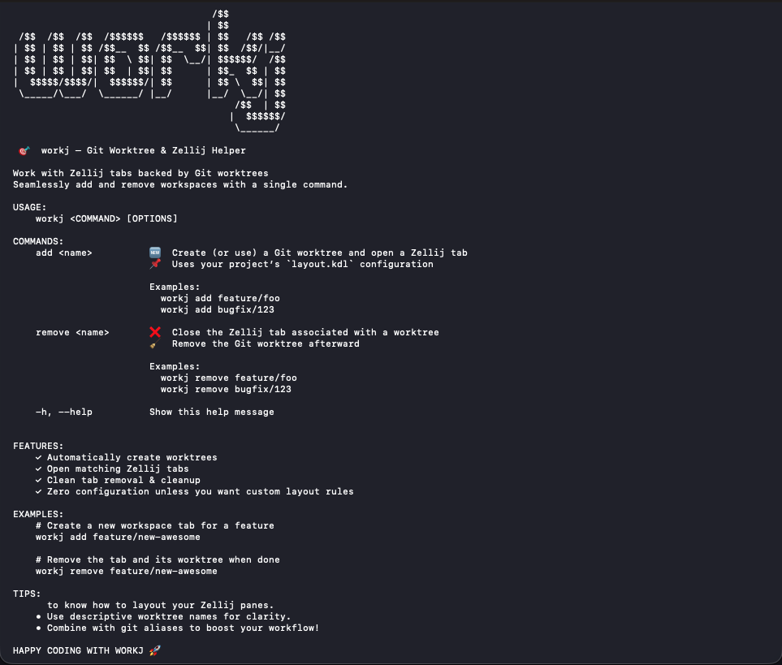

# workj
Git worktrees in Zellij.

```sh
                                   /$$          
                                  | $$          
 /$$  /$$  /$$  /$$$$$$   /$$$$$$ | $$   /$$ /$$
| $$ | $$ | $$ /$$__  $$ /$$__  $$| $$  /$$/|__/
| $$ | $$ | $$| $$  \ $$| $$  \__/| $$$$$$/  /$$
| $$ | $$ | $$| $$  | $$| $$      | $$_  $$ | $$
|  $$$$$/$$$$/|  $$$$$$/| $$      | $$ \  $$| $$
 \_____/\___/  \______/ |__/      |__/  \__/| $$
                                       /$$  | $$
                                      |  $$$$$$/
                                       \______/

    🎯  workj — Git Worktree & Zellij Helper

```



## Intro

A simplified way of using [Git worktrees](https://git-scm.com/docs/git-worktree) with [Zellij](https://zellij.dev).

## Installing

```sh
git clone https://github.com/Guilospanck/workj.git
cd workj/
./install.sh
```

After that, you can run it following [Usage](#usage) section.

## Configuration

Before using it, check if the default configs (`/configs/*`) make sense for you. If they don't, you can create a `~/.workj/config.cfg` file. The valid keys are displayed in `/configs/workj_config.cfg`.

- `main_branch` is the start point for the new branch (if it doesn't exist);
- `layout` is the path to the [Zellij layout](https://zellij.dev/documentation/creating-a-layout.html) you want to use when starting a new `workj add <branch>` command.

>[!NOTE]
>If the config file doesn't exist at `~/.workj/config.cfg`, the default values (the ones inside `/configs/*`) will be used.

## Usage

```sh
workj <command> <branch_name>
```

Available commands: add, remove.

Example: create a new [Git worktree](https://git-scm.com/docs/git-worktree) on a branch named `potato`:

```sh
workj add potato
```

This will create a new worktree at `$PROJECT_ROOT_LEVEL/../${PROJECT_NAME}__worktrees/potato` and open a new Zellij tab at that directory with panes based on the `layout.kdl` file.

To remove it:

```sh
workj remove potato
```

## Development

### Build

Build it:

```sh
zig build
# just build

# For release:
zig build -Doptimize=ReleaseSafe
# just release
```

Run it:

```sh
./zig-out/bin/workj <commmand> <branch_name>
```

Or you can also do both of them in one line:

```sh
zig build run -- <command> <branch_name>
# just run <command> <branch>
```

### Tests

You can run tests with:

```sh
zig build test
# just tests
```

Be aware that it will only print to stderr if there is an actual error in the test or if you did use something like `std.debug.print`. 

Optionally, you can also run a specific test file with:

```sh
zig test <path_to_test_file>
# zig test src/git_test.zig
```

or all of them:

```sh
zig test src/tests.zig
```

>[!NOTE]
>Each `*_test.zig` file you create, you MUST import it in `src/tests/index.zig` in order for the `zig build test` command to find it.

### TODOs

- [x] Convert shell to zig
- [x] Add a workj config file
- [x] Validate the outputs to stdout/stderr
- [x] Validate allocator to use
- [ ] Allow user to define a specific `.workj/config.cfg` at the repo level, so it can be customised per repository.
- [~] Add tests
    - [ ] validate if Zellij has a "sandbox" mode for tests
    - [ ] for that matter, maybe git also has
